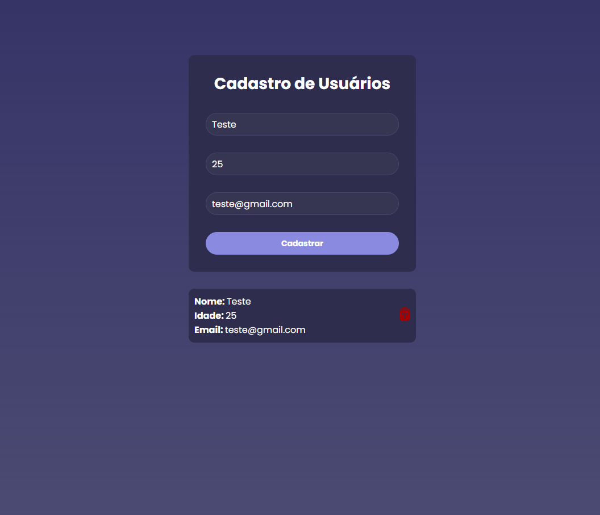

<h1 align="center"> Front-end + API </h1>

Roberto Santos  
Desenvolvedor Web</h3>

  <a href="#tecnologias">Tecnologias</a>&nbsp;&nbsp;&nbsp;|&nbsp;&nbsp;&nbsp;
  <a href="#projeto">Projeto</a>&nbsp;&nbsp;&nbsp;

 

  

### 🚀 Tecnologias

✅ React.js
✅ Vite
✅ Node.js
✅ JavaScript
✅ Mongo DB
✅ Prisma
✅ Json
✅ Axios
✅ Git
✅ Github

 

### 💻 Sobre o Projeto

O projeto Cadastro de Usuario foi desenvolvido para praticar uma conexão de projeto front-end com uma API, utilizando Mongo DB como banco de dados e o prisma para organizar as informaçoes salvas em Json.

 

---

by betox.santos

